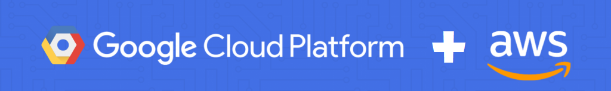

.                     |.
:--------------------:|:--------------------:
  |

# gatech-api

Spring Boot REST API deployed to Google App Engine F1 and managed by AWS API Gateway.

## Setup

For local development, you will need to:

1. Install Java 11 and Maven 3.6.3

2. Provision Backendless Project and export `BACKENDLESS_APPLICATION_ID` and `BACKENDLESS_API_KEY` environment variables

3. Install [gcloud sdk](https://cloud.google.com/sdk/docs/downloads-interactive#linux), run `gcloud init`, and select
the correct project

4. Run `mvn clean install` and `mvn spring-boot:run`

5. Access API at [localhost:8080/api/v1](http://localhost:8080/api/v1)

6. Access Swagger UI at [localhost:8080/swagger-ui.html](http://localhost:8080/swagger-ui.html)

7. Deploy to Google App Engine via `envsubst` (details in .travis.yml) and `gcloud app deploy app.yaml --quiet`
