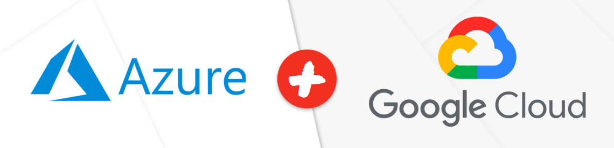

.                     |.
:--------------------:|:--------------------:
  |

# gatech-api

Spring Boot REST API deployed to Google App Engine B1 and managed by Azure API Management.

## Setup

For local development, you will need to:

1. Install Java 11 and Maven 3.6.3

2. Provision GCP Project with Firestore

3. Set environment variable `GOOGLE_CLOUD_PROJECT` to GCP Project Id

4. Run `mvn clean install` and `mvn spring-boot:run`

5. Access API at [localhost:8080/api/v1](http://localhost:8080/api/v1)

6. Access Swagger UI at [localhost:8080/swagger-ui.html](localhost:8080/swagger-ui.html)

7. Deploy to Google App Engine via `mvn appengine:deploy`
